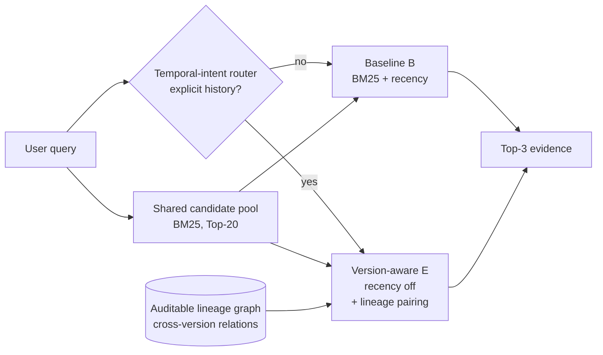
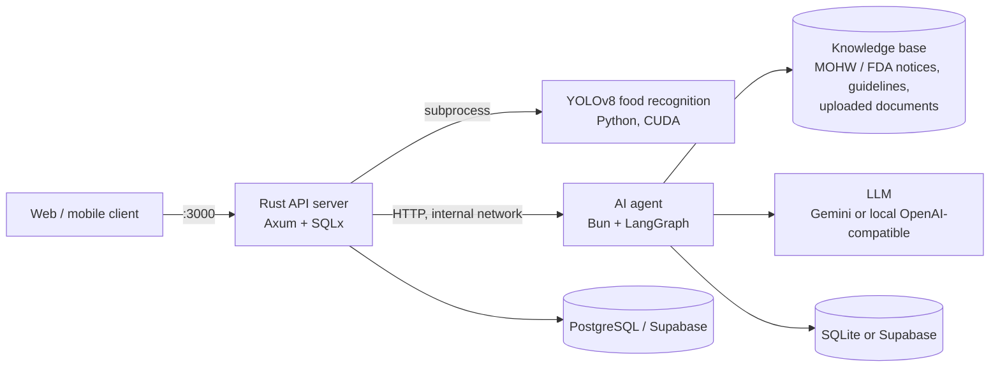

# Healthy Diet AI Agent — Version-Aware RAG for Evolving Nutrition Guidelines


English | [日本語](README_jp.md) | [繁體中文](README_zh.md)

This repository contains a nutrition-advice AI agent and the research behind its retrieval layer. It is the **follow-up to our first paper**, whose system is the [PU-Hub/healthy-diet](https://github.com/PU-Hub/healthy-diet) project (a healthy-diet app with YOLO food recognition and LLM-based advice). The first work established the end-to-end application. This project focuses on one open problem we found while building it: **how a retrieval-augmented generation (RAG) system should handle health guidelines that change over time.**
<!-- TODO: add the first paper's full citation (title, venue, year) here. -->

> **Research question.** When a knowledge base holds several versions of an official guideline, which evidence should a RAG system retrieve: the newest version, the older one, or both? And how do we show this without overstating the results?

---

## Table of Contents

1. [Highlights](#1-highlights)
2. [From the First Paper to This Project](#2-from-the-first-paper-to-this-project)
3. [Research Problem](#3-research-problem)
4. [Method: Conditional Version-Aware Retrieval](#4-method-conditional-version-aware-retrieval)
5. [Evaluation Methodology](#5-evaluation-methodology)
6. [Research Trajectory and Results](#6-research-trajectory-and-results)
7. [What Makes This Project Distinctive](#7-what-makes-this-project-distinctive)
8. [Limitations and Future Work](#8-limitations-and-future-work)
9. [System Architecture](#9-system-architecture)
10. [Deployment](#10-deployment)
11. [Local Development](#11-local-development)
12. [API Overview](#12-api-overview)
13. [Repository Structure](#13-repository-structure)
14. [Reproducing the Experiments](#14-reproducing-the-experiments)

---

## 1. Highlights

- **Clear problem scope.** Standard RAG ranks by relevance, sometimes with a preference for newer documents. Neither can tell an old recommendation that was *replaced* from one that still applies to a *specific group of people*, or from one the user *explicitly asked to compare*. We model these cross-version relations directly.
- **Conditional, not always-on.** Cross-version evidence pairing is turned on only when the query asks about history or a comparison. Every other query behaves exactly like the baseline, and this is guaranteed by design.
- **Main result (V7 fresh held-out pilot, 40 unseen questions).** On explicit-history questions, Recall@3 improved by **+0.425** over BM25 + recency (95% CI [0.275, 0.575], exact sign-flip p = 0.00024). 13 questions improved, 7 tied, 0 got worse. There were **zero** unsafe (outdated) evidence hits on the control questions.
- **Negative results reported.** An earlier 96-question confirmatory study (V6) found **no** improvement. We kept the result, traced the cause (the pairing step never fired), and fixed the method before running a new, unseen test. The failures and the recovery are both documented.
- **Rigorous evaluation.** Parameters were frozen before test questions were written. Questions and gold labels were sealed with SHA-256 hashes. The retrieval runner never reads the gold labels, each fresh test can run only once, and a second, separately written program recomputed every metric.
- **Deployable system.** The research sits inside a working application: a LangGraph agent (TypeScript/Bun), a Rust API server, and a YOLO food-recognition model. All three start with a single `docker compose up`.

---

## 2. From the First Paper to This Project

| | First paper — [PU-Hub/healthy-diet](https://github.com/PU-Hub/healthy-diet) | This project |
|---|---|---|
| Focus | End-to-end healthy-diet application | Retrieval quality of the AI advisor (RAG) |
| Core technology | Rust API, YOLO food recognition, Gemini-based nutrition advice | LangGraph agent, versioned knowledge base, version-aware retrieval |
| Main question | Can an app recognize meals and give nutrition advice? | Is the evidence behind that advice *current*, *applicable*, and *complete*? |
| Evaluation | System functionality | Pre-registered, sealed, single-use held-out retrieval experiments |

While building the first system, we found that grounding advice in official guidelines is not enough by itself. Guidelines are revised, such as the Dietary Guidelines for Americans 2015 → 2025 and WHO updates. A retriever can return a passage that sounds authoritative but has been replaced. This repository studies that failure. The components from the first project (the Rust API and the YOLO service) are now merged in under [`services/`](services/), so the whole system can be deployed together.

---

## 3. Research Problem

A versioned corpus produces several kinds of relations between passages from different editions:

| Relation | Meaning | What retrieval should do |
|---|---|---|
| `superseded` / `deprecated` | A newer statement replaces an older one | Do not present the old statement as current guidance |
| `compatible` / `complementary` | Both passages remain valid and add to each other | Keep both where useful |
| `conditional_difference` | The answer depends on population or condition (e.g., pregnancy, infants) | Keep the passage that matches the user's condition |
| explicit history request | The user asks "what changed?" or "what was the old advice?" | Retrieve **both** the historical and the current evidence |

Always preferring the newest document fails the last case. Keeping every version fails the first. The research question is **when** version relations should change what gets retrieved, and whether that can be done without adding outdated evidence to normal queries.

---

## 4. Method: Conditional Version-Aware Retrieval



1. **Shared candidate pool.** Every system ranks the same Top-20 BM25 candidates, so any difference comes from the policy, not from different recall.
2. **Temporal-intent router.** A rule-based detector decides whether the query explicitly asks for historical or cross-version information.
3. **Lineage pairing.** For history queries, the highest-ranked passage is linked to its lineage, the chain of versions of the same recommendation. Its cross-version counterpart gets a fixed score boost (`pair_boost = 0.5`, with 2 reserved slots), so historical and current evidence can both reach the Top-3.
4. **Recency as default.** All other queries use the recency-weighted baseline unchanged (`E ≡ B`). This is a design invariant (不變條件), and the experiments confirm the implementation keeps it.

To isolate the policy's effect, six systems are compared:

| System | Definition |
|---|---|
| A | BM25 |
| B | BM25 + recency (**baseline**) |
| C | Recency turned off for history queries, no pairing |
| D | Lineage pairing on for **every** query |
| E | Recency off **and** lineage pairing, for history queries only (**proposed**) |
| F | E without the pair boost (identical to C by definition; used as an ablation check) |

This study covers the **retrieval stage** only. Version errors start at evidence selection, so the generator is left out to avoid mixing policy effects with differences between LLMs. Whether better evidence leads to better answers is left for future work.

---

## 5. Evaluation Methodology

The protocol is designed so that a positive result cannot come from data leakage (資料洩漏) or tuning on the test set:

- **Freeze before writing questions.** Retrieval code, tokenizer, router, candidate K, boost, and recency λ are hashed and frozen ([`FROZEN_METHOD_PACKAGE.json`](experiments/version_aware_rag/configs/v7_pilot/FROZEN_METHOD_PACKAGE.json)) before any test question is drafted.
- **Sealed gold labels.** Queries and gold labels (the correct evidence for each question) are sealed with SHA-256 manifests. The one-time retrieval runner has no access to the gold file.
- **Single use.** A fresh-test guard prevents a second run once results are opened. After that, a test set may only be reused as *development* data.
- **Independent recomputation.** A second, independently written evaluator recomputes every headline metric.
- **Reported statistics.** Paired effect size, a 95% lineage-clustered bootstrap confidence interval, an exact paired sign-flip test, and counts of improved, tied, and regressed questions.
- **Stated annotation provenance.** Each V7 question was checked by three isolated AI reviews and labelled *AI-triangulated, source-grounded*. An earlier 16-question set was reviewed by a nutritionist. The two are never merged or described as the same kind of expert validation.

---

## 6. Research Trajectory and Results

The project went through several stages, including failed ones. Each stage changed the next design.

| Stage | Data | Outcome | What we learned |
|---|---|---|---|
| **Early held-out** | 8 broad queries | Always-on version policy **below** the recency baseline (Recall@3 0.208 vs 0.583) | Applying version rules to every query hurts. The hypothesis was narrowed to *explicit-history* queries |
| **V5 fresh pilot** (R2.10) | 16 queries, nutritionist-reviewed | Micro Recall@3 0.625 → 0.833. Explicit-history 0.375 → 1.000, joint historical+current coverage 0 → 1.0 | A promising direction, but only 4 explicit-history questions (p = 0.125) |
| **R2.19–R2.21 ablations** | Development | BM25 + MiniLM hybrid raised candidate Recall@20 0.904 → 0.981, but current-only Recall@3 fell 1.00 → 0.83 | The pre-set promotion gate failed, so the hybrid was **not** adopted |
| **V6 confirmatory** | 96 queries, 20 official PDFs, 1,601 pages, 3,535 chunks | E − B = **−0.031** (p = 0.5). Candidate Recall@20 only 0.48. Pairing activated on **0/32** history queries | Negative result. Root cause: passage-level seeds did not line up with the lineage endpoints, so pairing never ran |
| **V7 fresh pilot** | 40 **new** queries (20 history, 10 current-only, 10 hard-negative) | E − B = **+0.425**, CI [0.275, 0.575], p = 0.00024, 13 / 7 / 0 | Once passages were properly linked to lineages, the conditional policy worked as intended |

### V7 results by system (macro Recall@3)

| System | Explicit history (n = 20) | Current only (n = 10) | Hard-negative current (n = 10) | Unsafe hit@3, hard-negative |
|---|---:|---:|---:|---:|
| A — BM25 | 0.100 | 0.300 | 0.500 | 0.10 |
| B — BM25 + recency (baseline) | 0.100 | 0.300 | 0.500 | **0.00** |
| C / F — recency off only | 0.100 | 0.300 | 0.500 | 0.00 |
| D — always-on pairing | 0.425 | 0.900 | 0.800 | 0.10 |
| **E — conditional pairing (proposed)** | **0.525** | 0.300 | 0.500 | **0.00** |

What the table shows:

- **Turning recency off does not help by itself.** C and F equal B, so E's gain comes from lineage pairing, not from removing the recency preference.
- **Always-on pairing covers more evidence, but brings in outdated evidence.** D raises recall on control questions but returns replaced evidence on hard-negative questions (unsafe hit@3 = 0.10, versus 0 for B and E). This trade-off is why the router exists.
- **The router and pairing both worked.** The router was perfect on history queries (20 TP / 0 FN / 0 FP), and pairing activated on 20/20 of them, compared with 0/32 in V6.

Full results: [`results/v7_pilot/V7_PILOT_RESULTS.md`](experiments/version_aware_rag/results/v7_pilot/V7_PILOT_RESULTS.md).

---

## 7. What Makes This Project Distinctive

1. **A new problem definition.** Most RAG work optimizes relevance, and temporal RAG usually treats time as a single ranking signal. We treat *version relations* (supersession, compatibility, conditional applicability) as separate knowledge that decides **whether** an older passage should be kept, dropped, or paired.
2. **Selective activation with a safety guarantee.** Because of the router, the method can only change results for queries that ask about history or comparisons. All other queries are provably identical to the baseline. System D shows empirically why this matters.
3. **Negative results used to improve the method.** The V6 failure was not hidden or re-tuned on the same data. It was diagnosed (candidate-pool limits, the gap between passages and lineages, router misses) and fixed. The fixed method was then tested on questions nobody had seen before.
4. **Reproducible research infrastructure.** Frozen method packages, sealed gold labels, single-use test guards, checksum manifests, and an independent evaluator form a reusable protocol for evaluating RAG on changing knowledge bases.
5. **Research inside a working system.** The work sits inside a deployable health application: agent, API, and vision model together. This keeps the research question tied to a real product need.

---

## 8. Limitations and Future Work

These are stated plainly, because they define how far the claims go:

- **Small scale.** V7 is a 40-question pilot over a controlled 32-chunk corpus. It is not a large benchmark.
- **Retrieval stage only.** Answer correctness, citation entailment (whether a citation actually supports the claim), and user-level risk are not evaluated yet.
- **AI-triangulated labels.** Three isolated AI reviews do not replace review by domain experts.
- **Lineage selection is imperfect.** Pairing picked the correct lineage in 15 of 20 cases, and 2 of 20 history questions failed at candidate generation.
- **Lineages are assumed known.** The method assumes an auditable version-relation graph already exists. Discovering it automatically is future work.
- **Not yet in the live agent.** The chat agent in `src/` still uses a lightweight keyword retriever over the MOHW, uploaded-document, and nutrition-rule sources. The version-aware retriever lives in `experiments/`, and connecting it to the runtime is the next engineering step.

**Next steps:** a V8 study with more documents, version chains of three or more editions, Chinese queries and paraphrase groups, and answer-level evaluation, each sealed before execution.

---

## 9. System Architecture



| Component | Location | Stack | Role |
|---|---|---|---|
| AI agent | [`src/`](src/), [`agent_skills/`](agent_skills/) | Bun, TypeScript, LangGraph | Chat, tool use, RAG, knowledge graph, MOHW sync, profile-update approval |
| API server | [`services/api/`](services/api/) | Rust, Axum, SQLx | Auth (JWT, Discord OAuth), diet records, chat rooms, gateway to the agent |
| Food recognition | [`services/yolo/`](services/yolo/) | Python, Ultralytics YOLOv8 | Detects food items in meal photos; called by the API |
| Research code | [`experiments/version_aware_rag/`](experiments/version_aware_rag/) | TypeScript, Python | Corpus building, retrieval policies, sealed evaluations |

Agent features include streaming chat over Server-Sent Events, food-image analysis, nutrition calculation, web-page verification, an approval flow for profile updates, conversation summaries, and routing between Google and local models with automatic fallback.

---

## 10. Deployment

The whole system (agent, Rust API, and YOLO) starts with a single Docker Compose command.

**Requirements:** Docker with Compose v2, plus an NVIDIA GPU with the NVIDIA Container Toolkit for YOLO inference.

```bash
cp .env.example .env                           # agent settings
cp services/api/.env.example services/api/.env # API settings: DATABASE_URL, JWT_SECRET, ...
docker compose up -d --build
```

| Service | Port | Exposure |
|---|---|---|
| `healthy-diet-api` | `3000` | Public entry point |
| `healthy-diet-ai-agent` | `8001` | Internal only (`127.0.0.1` on the host); the API reaches it at `http://healthy-diet-ai-agent:8001` |

- **No GPU:** remove the `deploy:` block from `compose.yml` and set `YOLO_DEVICE=cpu` in `services/api/.env`.
- **Continuous deployment:** a push to `main` runs [`.github/workflows/deploy.yml`](.github/workflows/deploy.yml). It tests the agent, builds and pushes its image to GHCR, and redeploys on a self-hosted runner.

---

## 11. Local Development

The agent can run on its own using SQLite:

```bash
bun install
cp .env.example .env
bun run start                                   # HTTP server on :8001
bun run cli -- --message "Give me a low sugar dinner idea"
bun test
```

Key settings:

| Variable | Purpose |
|---|---|
| `STORAGE_BACKEND` | `sqlite` (standalone) or `supabase` (integration) |
| `AI_API_URL` | Local OpenAI-compatible model endpoint |
| `GEMINI_AI_API`, `GOOGLE_CHAT_MODEL` | Google model routing |
| `MOHW_NEWS_SYNC_*` | Background sync of MOHW / FDA fact-check notices |

Default agent behavior (prompts, response style, enabled RAG sources, search parameters) lives in [`agent_config.json`](agent_config.json). Environment variables override it per deployment. To adapt the agent to another advisory domain, replace `knowledge_base/AGENT.md` and `knowledge_base/NUTRITION_RULES.md` and adjust `agent_config.json`. No runtime code changes are needed.

---

## 12. API Overview

| Area | Endpoints |
|---|---|
| Chat | `POST /api/chat` (SSE), `POST /api/approve`, `POST /api/generate_title`, `GET /ping` |
| RAG documents | `GET/POST /api/rag/search`, `GET/POST /api/rag/documents`, `GET/DELETE /api/rag/documents/:id`, `POST /api/rag/documents/:id/reindex` |
| Knowledge ingestion | `POST /api/admin/knowledge/upload`, `POST /api/admin/knowledge/ingest/:id`, `GET /api/admin/knowledge/jobs/:jobId` |
| Knowledge graph | `POST /api/graph/extract-all`, `POST /api/graph/search`, `GET /api/graph/nodes/:id`, `GET /api/graph/relations/:id/evidence` |
| MOHW sync | `POST /api/news/sync`, `GET /api/news`, `GET /api/news/:id` |

The Rust API's endpoints are documented in [`services/api/openapi.yml`](services/api/openapi.yml). RAG document management requires the `X-Admin-User-Id` and `X-Admin-Role` (`admin` or `nutritionist`) headers.

---

## 13. Repository Structure

```
.
├── src/                          # AI agent (Bun + TypeScript + LangGraph)
│   ├── server/                   # Agent runtime, model routing, RAG, knowledge graph, MOHW sync
│   ├── storage/                  # SQLite / Supabase adapters
│   ├── rag_clean/                # PDF → clean Markdown (keeps tables as prose)
│   ├── cli.ts, index.ts          # CLI and HTTP entry points
│   └── serverHandlers.ts         # HTTP handlers
├── agent_skills/                 # Agent tools: knowledge search, vision, nutrition, web checks
├── knowledge_base/               # System prompt, nutrition rules, MOHW notices
├── services/                     # Merged from PU-Hub/healthy-diet
│   ├── api/                      # Rust API server + Dockerfile (bundles YOLO)
│   └── yolo/                     # YOLOv8 predictor and trained models
├── experiments/version_aware_rag/  # Research: protocols, sealed data, results, paper drafts
├── technical_docs/               # Design notes and change log
├── agent_config.json             # Declarative agent configuration
├── compose.yml                   # One-command deployment
└── Dockerfile                    # Agent image
```

---

## 14. Reproducing the Experiments

Everything the experiments depend on is versioned under [`experiments/version_aware_rag/`](experiments/version_aware_rag/):

- **Protocols and freeze reports:** `V*_PROTOCOL.md`, `*_FREEZE_REPORT*.md`, `configs/`
- **Sealed queries and gold labels:** `data/`, verified by `ARTIFACT_CHECKSUMS.sha256`
- **Runners and evaluators:** `scripts/v6/`, `scripts/v7/` (for example, `run_v7_fresh_retrieval.py`, `evaluate_v7_pilot.py`)
- **Results:** `results/` (raw rows, per-stratum tables, figures)
- **Stage reports:** `V7_PILOT_COMPLETION_AND_PAPER_UPDATE_ZH.md` and `V6_PHASE_3_PROGRESS_AND_PAPER_UPDATE_ZH.md` explain each design change and why it was made.

The V7 fresh test has already run once and its guard is locked. Re-running it would only give development evidence, not new held-out evidence.

A manuscript based on this work is in preparation.

---

## License

MIT. See [LICENSE](LICENSE).
