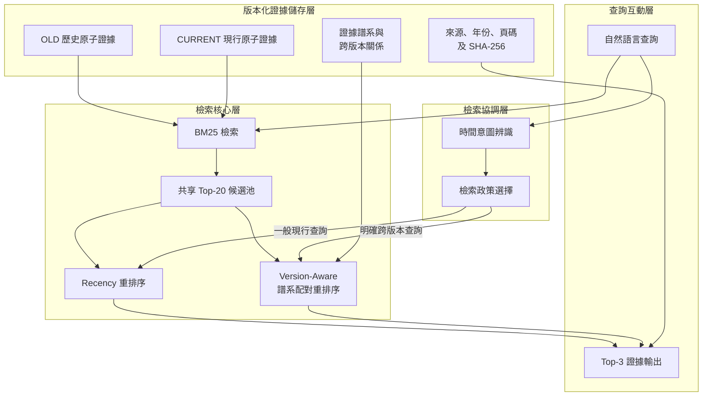
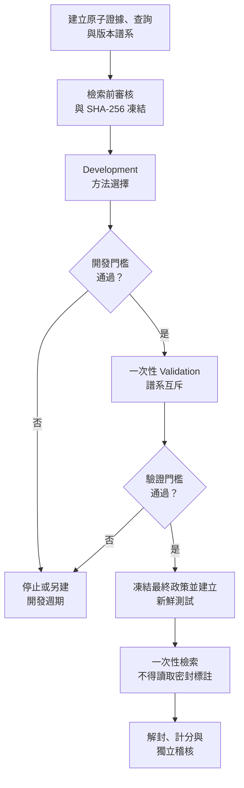

# 論文圖稿

## 圖 1　Version-Aware RAG 分層系統架構

**圖說：** 圖 1　Version-Aware RAG 分層系統架構。系統由查詢互動、檢索協調、檢索核心及版本化證據儲存四層構成；檢索協調層依查詢時間意圖選擇 Recency 或 Version-Aware 重排序，兩者共享相同的 BM25 Top-20 候選池。

## 圖 2　實驗凍結與一次性評估流程

**圖說：** 圖 2　實驗凍結與一次性評估流程。方法僅能在 Development 階段選擇；Validation 與新鮮測試各執行一次，且檢索完成前不得讀取密封標註。
