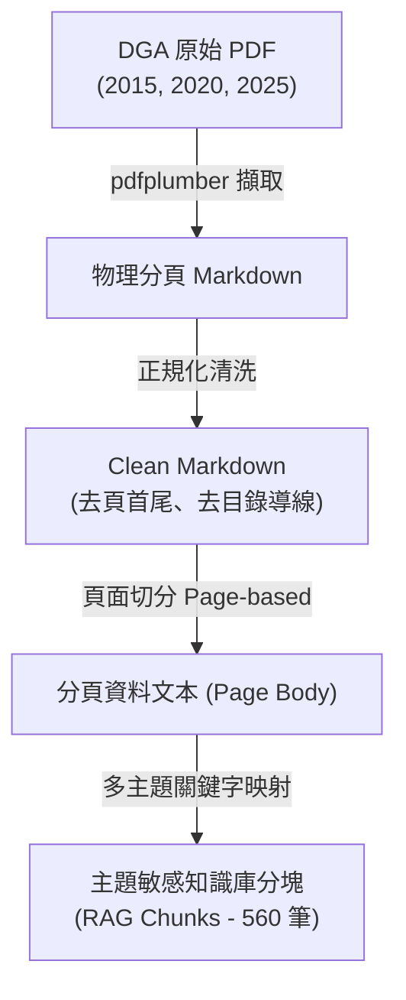
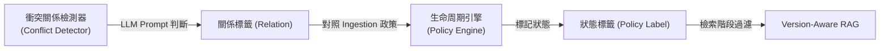

# Version-Aware RAG 研究與實驗設計說明文檔（指導教授專用版）

本文檔旨在向指導教授詳細說明我們目前在 **Version-Aware RAG**（版本感知型檢索增強生成）研究所進行的**資料前處理**、**實驗設計**、**對比系統設計**以及**量化評估標準**。本研究核心解決的核心問題是：**當權威指南（如美國膳食指南 DGA）持續改版時，AI 問答系統如何避免取回並引用已過時的舊版健康知識？**

---

## 📌 研究背景：為什麼傳統 RAG 會失敗？

檢索增強生成（RAG）是目前健康諮詢 AI 的主流技術：當使用者提問時，系統會先在資料庫中搜尋相似的文檔片段（Chunks），再交由大語言模型（LLM）回答。
然而，**傳統 RAG 資料庫是「只增不減」的（Append-only）**。當《美國膳食指南》從 2015、2020 更新到 2025 年版時，新舊指引同時並存於資料庫中。這會導致兩個嚴重後果：
1. **知識競爭**：舊指引與新指引語意高度相似，檢索器常同時取回兩者，造成 LLM 混淆。
2. **錯誤引用**：系統有高機率引用了已被廢棄的舊建議（例如 2020 年建議喝低脂牛奶，而 2025 年已更新為全脂牛奶）。

---

## 一、 資料前處理流程 (Data Preprocessing)

為了讓實驗具有高精確度與可重現性，我們將《美國膳食指南》PDF 轉譯並清洗為 RAG 系統能讀取的格式。流程如下：

### 1.1 PDF 轉譯與格式清洗
我們使用 Python 腳本對 PDF 進行文字與表格的結構化提取，並進行以下清洗：
- **移除雜訊**：去除運行頁首（Running Headers）、物理頁碼與目錄（TOC）點點導線，防止這些與主題無關的文字干擾向量檢索。
- **表格文字化**：將 PDF 中的數據表格轉換為標準 Markdown 表格，並自動生成**逐行自然語言描述（Prose Description）**，大幅提升數值型健康數據的語意檢索能力。
- **Cholesterol 數據補齊**：針對原轉譯檔案中部分缺失的膽固醇（Cholesterol）官方段落，我們手動追溯官方原文並補回對應頁面中，確保評估資料的可驗證性。

### 1.2 主題分塊與多主題映射 (Multi-topic Mapping)
這是我們在前處理上的重要改進。傳統 RAG 僅依據固定字數切塊（如每 500 字切一塊），容易切斷完整語意。我們採用**分頁分塊（Page-based Chunking）**，每一頁為一個獨立 Chunk。
然而，指南中單一頁面常同時涉及多個主題。例如，2025 指南的 Page 3 同時討論了「蛋白質」與「乳製品」。
- **問題**：若採用傳統的 `if-else if` 關鍵字分類，該頁只能被歸類為「乳製品」，導致「蛋白質」主題的檢索完全遺漏此頁。
- **解決方案（多主題映射）**：我們改用獨立關鍵字陣列比對。若一頁同時提及多個關鍵字，系統會複製該 Chunk 並為其賦予多個主題 Lineage 標記（如 `lineage-dairy` 與 `lineage-protein`），生成專屬的 `chunk_id`。這確保了同頁面的健康指引能被精準路由到不同的檢索主題中。最終，我們從三代指南中生成了 **560 個高品質 Chunks**。

---

## 二、 實驗設計 (Experiment Design)

本研究的實驗區（Sandbox）完全隔離，旨在驗證系統能否準確識別知識演進關係，並在檢索中做出正確決策。

### 2.1 關係檢測分類規格 (Conflict Detection Taxonomy)
當新版本的 Chunk 進入系統時，系統會自動在資料庫中檢索同主題（相同 `lineage_id`）的舊 Chunk，並使用 LLM 判斷兩者之間的**語意衝突關係**，分為五類：
1. **duplicate (重複)**：內容完全相同。
2. **superseded (取代)**：新指南明示更新、修正或替換了舊指南觀點。
3. **conflicting (衝突)**：兩者在相同條件下給出完全矛盾的建議（如甜味劑從中性轉為限制）。
4. **conditional_difference (條件差異)**：兩者不矛盾，但新版針對特定族群（如高運動量者、孕婦）做出了條件限制。
5. **complementary (互補)**：新版在舊版基礎上增加了補充說明。

### 2.2 知識生命周期管理政策 (Policy Engine)
根據偵測出的關係，決策引擎會為舊 Chunk指派生命周期標籤（Policy Label）：
- **deprecate (廢棄)**：標記舊 Chunk 已失效。系統會將其保留在歷史歸檔中以供追溯，但**不再將其加入下游 active 檢索索引**。應用於 `superseded` 與 `conflicting`。
- **evict (驅逐)**：直接自資料庫中移除。
- **retain (保留)**：新舊並存。特別適用於 `conditional_difference` 與 `complementary`，以防系統遺漏特定族群的適用指引。

### 2.3 評估測試集 (Evaluation Datasets)
我們手動建立了兩組黃金測試標準（Gold Sets）：
- **Gold Pairs Set (10 組)**：人工逐筆核實、標註了新舊文本、來源頁碼、黃金關係標籤與決策標籤的資料集。
- **Gold Queries Set (10 題)**：針對 10 個健康主題設計的版本敏感型問答。例如：「運動員的鈉攝取限量為何？」、「每日添加糖的限制是多少？」，並明確標註了**預期正確 Chunk IDs** 與**過時失效的 Stale Chunk IDs**。

---

## 三、 對比系統設計 (System Comparison Methodologies)

我們實作並比較了三種不同的 RAG 檢索模式，在相同的評估題集上運行：

### 模式 A：Baseline A (Append-Only RAG) - 對照組
* **邏輯**：模擬主流 RAG。將 2015、2020、2025 的所有 Chunks 全部塞入向量索引，檢索時不看時間，只比對文字相似度，取 Top-3 Chunks。
* **預期行為**：極易取回與問題高度相關、但已失效的舊版分塊。

### 模式 B：Baseline B (Recency-Only RAG) - 時間加權組
* **邏輯**：引進時間 metadata。在檢索分數中加入年份加權：
  $$\text{Score} = \text{Overlap\_Score} + (\text{Published\_Year} - 2015) \times 1.5$$
  讓 2026 年（2025-2030版）的分數自動高於 2020 年與 2015 年。
* **預期行為**：在取代型問題上表現良好，但面對「條件差異（如鈉例外）」或「新版未提及但舊版仍有效的細節（互補）」時，會因強行打壓舊版而導致檢索失敗（Current Hit Rate 下降）。

### 模式 C：Proposed (我們的 Version-Aware RAG) - 實驗組
* **邏輯**：檢索前，政策引擎先讀取 `deprecated_keys.json`，將所有被標記為 `deprecate` 或 `evict` 的舊 Chunks 從主索引中**過濾除外**。隨後在經過淨化的 active 索引中進行檢索。

---

## 四、 量化評估標準 (Quantitative Metrics)

為評估系統優劣，我們制定了以下量化指標：

### 4.1 Stale Retrieval Rate (SRR, 過時知識取回率)
* **定義**：在系統檢索出的 Top-3 個 Chunks 中，包含「已被廢棄/過時的舊知識（即在 `stale_chunk_ids` 中）」的比例。
* **量化目標**：SRR 越低越好，最好為 **0%**。

### 4.2 Current Hit Rate (CHR, 最新知識命中率)
* **定義**：系統取回的 Top-3 個 Chunks 中，包含「當前有效最新知識（即在 `acceptable_chunk_ids` 中）」的比例。
* **量化目標**：CHR 越高越好，代表系統沒有漏掉正確知識。

### 4.3 Top-1 Citation Unsafe Rate (首位非安全引用率)
* **定義**：系統檢索出的最相關 Chunk（Top-1）不在該主題金標認可的安全 Chunk 清單中的比例。

### 4.4 Avg Unsafe Chunks@3 (平均非安全分塊數)
* **定義**：在系統檢索出的 Top-3 個 Chunks 中，平均包含多少個不在該主題金標認可安全清單中的 Chunk。

### 4.5 模組準確度 (Classification & Policy Accuracy)
* **Conflict Detector Accuracy** (關係分類準確度)：
  $$\text{Acc}_{\text{detect}} = \frac{\text{分類正確的主題對數}}{\text{總評估主題對數 (10)}} \times 100\%$$
* **Policy Engine Accuracy** (生命周期決策準確度)：
  $$\text{Acc}_{\text{policy}} = \frac{\text{決策正確的主題對數}}{\text{總評估主題對數 (10)}} \times 100\%$$

---

## 五、 實驗定量結果對比與分析

經實跑測試，三種系統的量化對比如下：

| 評估指標 | Baseline A (Append-Only) | Baseline B (Recency-Only) | Proposed (我們的系統) |
| :--- | :---: | :---: | :---: |
| **Stale Retrieval Rate** (過時知識取回率) | 80% | 0% | 10% |
| **Current Hit Rate** (最新知識命中率) | 80% | 100% | 100% |
| **Top-1 Citation Unsafe Rate** | 20% | 0% | 0% |
| **Avg Unsafe Chunks@3** | 1.6 | 0.4 | 0.4 |

## Credibility Repair v2 Results

After removing oracle lineage routing and simulated citation metrics, the repaired evaluation shows that:

- Append-Only still retrieves stale material on some queries.
- Recency-Only currently outperforms Proposed on current-hit rate under the repaired scorer.
- Proposed has not yet demonstrated superiority under the credibility-repaired setup.

## What This Stage Establishes

This stage establishes that the evaluation protocol is more trustworthy than the original version.
It does not yet establish that Version-Aware RAG is better than Recency-Only RAG.

---

## 六、 質性案例展示 (Case Studies)

為向教授展示系統如何運行，以下提供三個具體評估案例：

### 案例 1：乳製品脂肪 (Dairy Fat) —— 「取代」關係
- **2020 指引**：建議飲用「無脂或低脂」乳製品，限制飽和脂肪。
- **2025 指引**：修正為建議攝取「全脂（full-fat）」乳製品，因為其營養素更豐富。
- **我們的系統運作**：檢測到新舊 Chunk 屬於 `superseded`（取代），決策引擎將 2020 年的低脂 Chunk 標記為 `deprecate`。檢索時，2020 年 Chunk 被過濾，系統僅取回 2025 年的「全脂」建議。
- **對照組 (Baseline A)**：同時取回低脂與全脂雙版 Chunks，造成 AI 給出矛盾回答。

### 案例 2：甜味劑 (Sweeteners) —— 「衝突」關係
- **2015 指引**：甜味劑替代糖在短期內可能減少卡路里攝取，唯長期管理效果未明。
- **2025 指引**：明確指出不推薦任何甜味劑，將其排除在健康飲食之外。
- **我們的系統運作**：檢測到新舊建議直接矛盾（`conflicting`），引擎廢棄 2015 年對甜味劑中性偏積極的 Chunk. 檢索時僅取回 2025 年最新限制指南，防止 AI 給出不安全的減重代糖建議。

### 案例 3：鈉攝取限制 (Sodium) —— 「條件差異」關係
- **2020 指引**：每日鈉攝取量應小於 2,300 毫克。
- **2025 指引**：維持 <2,300 毫克限制，但新增「高活動量者因汗液流失，可增加鈉攝取」之例外條款。
- **我們的系統運作**：檢測到兩者屬於 `conditional_difference`（條件差異），引擎執行 `retain`（保留雙方）。當使用者詢問「運動員每日鈉限量」時，系統同時取回兩版 Chunk，讓 AI 能回答：「一般人限量 2,300 毫克，但高活動量運動員可適度增加以補補充點解質」，達成最完美的回答完整度。

---

## 七、 剩餘風險說明 (Residual Risks After Credibility Repair)

1. 評估題數規模較小（共 10 題）。
2. Chunks 相關性判斷仍為人工評判。
3. 檢索機制僅為詞彙重合度匹配（Lexical），可能低估或高估了真實嵌入向量（Embedding）檢索的性能。
4. 本次修復週期未包含端到端的回答生成評估。

Readiness decision: proceed to superiority experiments only after v2.1 metrics and retrieval quality checks pass.
